# GA Project 4 - Discover Sweden

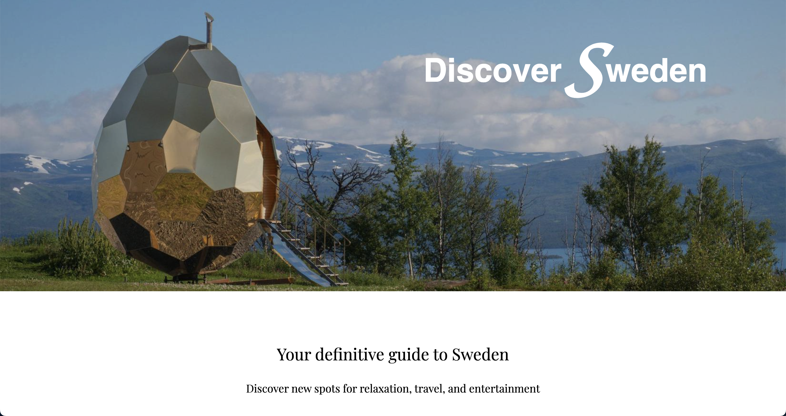

# Contents
- [Description](#description)
- [Technology used](#technologies-used)
- [Project brief](#brief)
- [Planning](#planning)
- [Build process](#build-process)
- [Challenges](#challenges)
- [Wins](#wins)
- [Key learnings](#key-learnings)
- [Bugs](#bugs)
- [Future improvements](#future-improvements)

# Description

The aim of this project was to build a full-stack app using React on the frontend and Django on the backend. I love travelling and sharing new experiences with others, so I decided to make a site that makes it easy and fun to explore Sweden.

# Deployment link

https://discover-sweden.herokuapp.com/

The site can be used without logging in, however more features are available to logged in users such as the ability to add an attraction or add a city.

Feel free to register a new account and use that if you wish.

Otherwise, there are 13 already-populated user accounts you can log in as. 
One of these is arianapiccola: 
email: ariana@email.com password: passwrod 

# Getting Started/Code Installation

- Clone the repo to your local machine
- From the root directory, run pipenv install to install the backend dependencies.
- In a parallel terminal, cd into ‘client’ and run npm i to install the dependencies.
- Back in the root directory, run pipenv shell. Finally, run python manage.py runserver. You will now see the site is visible at localhost:8000.

# Timeframe & Working Team (Solo/Pair/Group)

Timeframe: 1.5 weeks. 
Solo project.

# Technologies Used

- Frontend: React, JSX,  SASS, Cloudinary, React-mapbox-gl.
- Backend: Python, Django, PostgreSQL, Psycopg2-binary, Pylint, Django REST framework, Pyjwt.
- Tools: Insomnia, TablePlus, Heroku, Trello, Excalidraw, QuickDBD.

# Brief

* Build a full-stack application by making your own backend and your own front-end
* Use a Python Django API using Django REST Framework to serve your data from a Postgres database
* Consume your API with a separate front-end built with React
* Be a complete product which most likely means multiple relationships and CRUD functionality for at least a couple of models
* Implement thoughtful user stories/wireframes that are significant enough to help you know which features are core MVP and which you can cut
* Have a visually impressive design to kick your portfolio up a notch and have something to wow future clients & employers. ALLOW time for this.
* Be deployed online so it's publicly accessible.

# Planning

I wanted to keep this project very simple so that I could focus on creating a very slick and complete app within the time constraints as a solo person. I started by drawing up a basic wireframe of simple pages, and then drew my ERD based on that. I also used Trello to keep track of progress. I find Trello particularly useful for the ability to add todos as ideas pop up since it is very easy to create and place new cards without affecting the flow of the Trello board. 
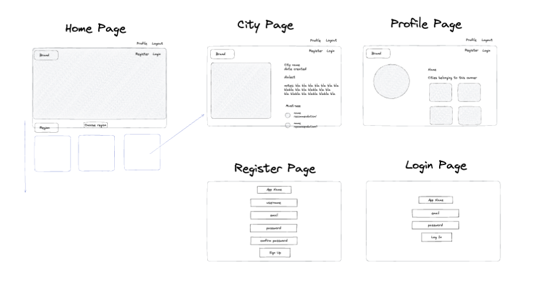
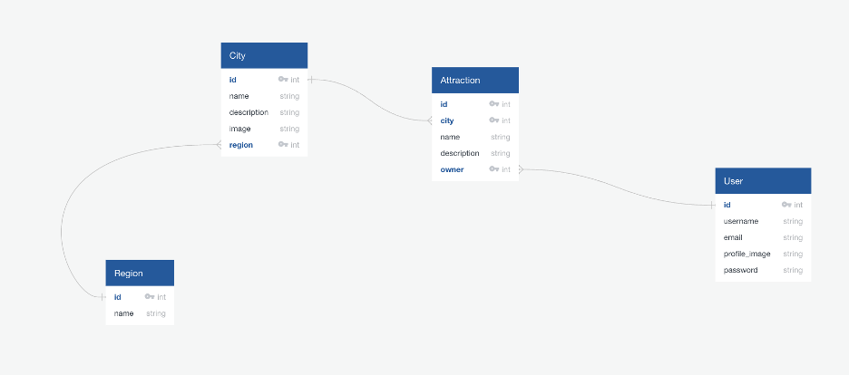

# Build Process

I began by building out the backend, which involved creating my routes and models and making the migrations needed for these. Since I had not put enough time and detail into my planning, the models and relationships did need replanning and amending a few days into this project, which cost me quite a bit of time - a mistake I will definitely not make again! 
The final models included users, cities, attractions, and regions. I populated the ‘owner’ field on both cities and attractions as I knew I would need this for features such as displaying a user’s created entries on their profile, as well as for displaying reviews on the city page. 
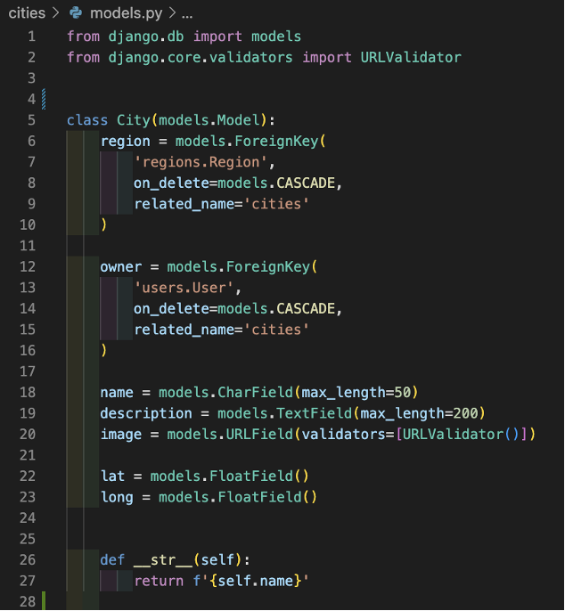
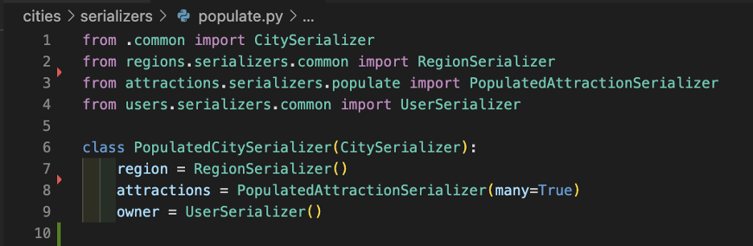

With the backend built, I focused on creating a highly interactive frontend. I wanted to include maps to give an authentic sense of exploration to the user, and for this I used MapBox and react-mapbox-gl. Building up the maps was very interesting as it opened up a lot of possibilities for my site. Firstly, I used the latitude and longitude of all cities and attractions in my seeds to place markers on the map. Each marker when clicked shows a popup with details of the city or attraction it belongs to, and this popup disappears when the user clicks elsewhere on the map so that the user can see the full map again to give a more user-friendly exploration experience. 
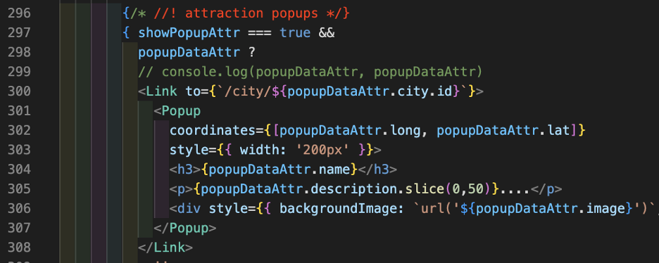

I also prevented auto-zoom-out when clicking on a marker so that the map doesn’t keep changing zoom level. Additionally, I gave the cards on the homepage a hover feature (using mouseover for desktop and touchStart for mobile users) so that the hovered city or attraction appears on the map, making it more easy and enjoyable for the user to find the location of places they are interested in.  
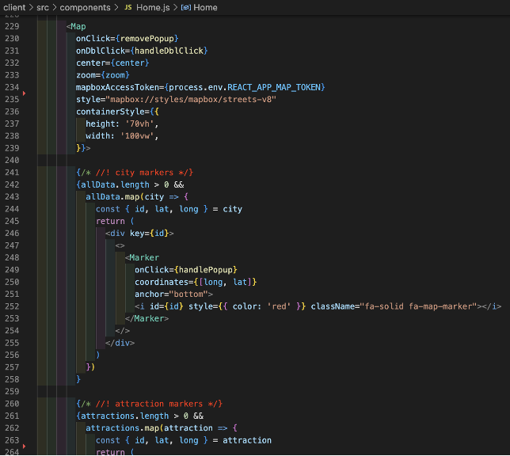
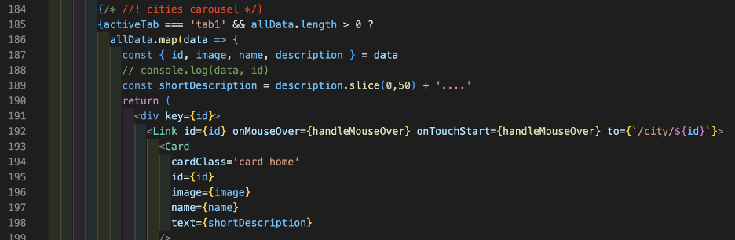

When a city or attraction is clicked (both cards and popups are clickable on the homepage; and cards can be clicked from a user profile) the user is taken to the city page full of details and photos of the city; and if it was an attraction that was clicked then its popup will also appear on the map so the user can easily find its location on the newly loaded page. This is accomplished by storing the attraction’s id in local storage, and then checking local storage when rendering the city page. 
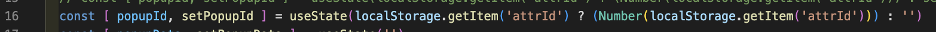

Additionally, on any given city page, the map will be focused on that city’s location and will only display attraction markers for that city. I also added maps on all forms so that the user can drop a pin for the location of the city or attraction they are adding (onDblClick for desktop users, onTouchStart for mobile users).

Another feature I chose to add was tabs. On the homepage, tabs along with a simple flexbox carousel make a much cleaner interface where the user can select if they want to browse by city or attraction. On profile pages, tabs allow the user to select whether they wish to see editing functionality or entries created by that user. 
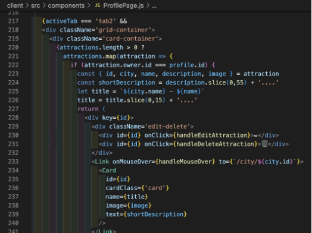

Also, I wrote conditional code that checks if a user is logged in or not. Buttons display differently, with add and edit options only available for logged in users; and the profile pages will only display the editing tab if you are the logged in owner of that account. 
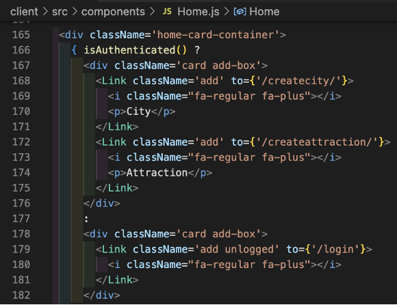

I would also like to briefly draw attention to some of the other features I included: modals for edit and delete buttons to check if user wants to go ahead and avoid accidental deletions; each page starts at the top on initial render; cards have different hover effects and character limits depending on page; added Cloudinary on all forms, with various default images in case the user doesn’t want to upload an image; user profiles show not only their creations but also their total counts of city and attraction entries.

# Challenges

The biggest challenge was figuring out what was causing a particular bug. The cards on the home page when clicked take the user to the city page for that city or attraction. Almost all of the time this worked without any issues, however occasionally this would crash the site. It was confusing trying to figure out how something that generally worked could on rare occasions not work! However, I wasn’t content to leave such a bug in my app so I wouldn’t give up on finding a solution. Eventually I realised the issue was in retrieving the ids from local storage. Therefore, I managed to solve this issue with the code below, setting the popupId as an empty string if not found. This does mean that sometimes the attraction popup is not shown on the city page at render time, however this is a better option than allowing the app to crash. 

# Wins

I’m proud that I was able to create a busy, bustling, beautiful app full of functionality and users despite losing several days of project time!

I am also pleased with the map functionality, as I was able to use the map in different ways on different pages depending on what would best enhance the user experience.

# Key Learnings

I became much more comfortable with Python and SQL by using Django for the backend. While some parts of this were challenging after being used to noSQL databases, I will definitely be using this again!

I also learned why planning should never be minimal. The more detail the better!

# Bugs

I believe I managed to squash all bugs.

The most difficult bug to understand was when being linked to the city page would crash the app - if the link worked 99% of the time, why would it occasionally crash the site? In the end I found a solution to this, which was to set the popupId to an empty string if the attraction’s id is not found, although this did mean forfeiting the pop up on some page loads. However, this is a much better solution than letting the app crash!

# Future Improvements

I ran out of time to polish the design as much as I would have liked. Therefore I would like to improve the look of the navbar, the forms, and the first tab of the logged in user’s profile page.

Again due to losing a lot of time some parts were written in a hurry, so I would also like to refactor my code!

[Updates] 
- Improved navbar by adding logo and profile image
- Added Swedish-flag-coloured loading gif
